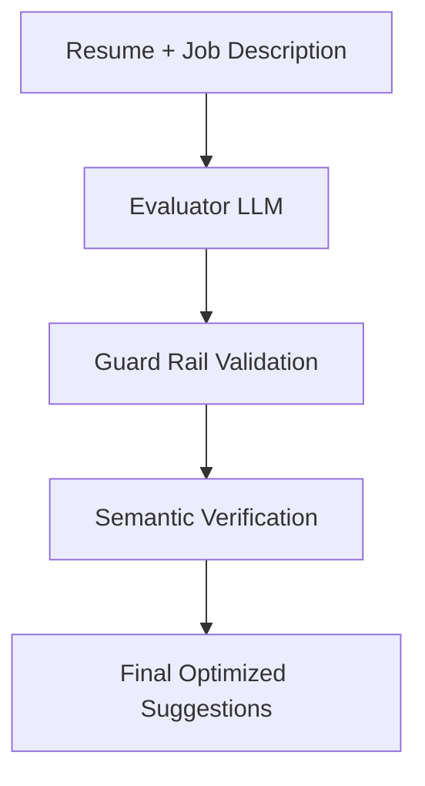

# AI Package

> A comprehensive AI-powered resume optimization system built for ResumeMoto, featuring ATS (Applicant Tracking System) analysis, multi-provider AI integration, and intelligent resume enhancement suggestions.

## Overview

The `@repo/ai` package is the core AI engine for ResumeMoto, designed to analyze resumes against job descriptions and provide intelligent optimization suggestions. It leverages multiple AI providers (OpenAI, Anthropic, Google) to deliver accurate, contextual resume improvements that help users pass ATS systems and land more interviews.

## 🎯 Key Features

### ATS Resume Analysis

- **Job Description Matching**: Analyzes resumes against specific job descriptions
- **Job Title Optimization**: Optimizes resumes for specific job titles
- **Multi-stage Pipeline**: Evaluator → Guard Rails → Semantic Verification
- **Scoring System**: Comprehensive scoring across 6 key categories

### Multi-Provider AI Support

- **OpenAI**: GPT-4, GPT-4 Turbo, GPT-4o models
- **Anthropic**: Claude 3 Haiku, Claude 3 Sonnet, Claude 3 Opus
- **Google**: Gemini 2.5 Flash, Gemini Pro models
- **Intelligent Model Selection**: Automatic model selection based on user plan

### Advanced Pipeline Architecture

- **Evaluator LLM**: Heavy-duty analysis using premium models
- **Guard Rails**: Deterministic validation and safety checks
- **Semantic Verification**: Lightweight verification of suggestions
- **Batch Processing**: Efficient processing of multiple suggestions

### Analytics & Observability

- **PostHog Integration**: Comprehensive usage analytics and tracing
- **Error Tracking**: Detailed error reporting and monitoring
- **Performance Metrics**: Token usage, cost tracking, and performance monitoring

## 🏗️ Architecture

### Pipeline Flow



### Scoring Categories

The system evaluates resumes across 6 key categories:

1. **Skills & Keywords** (35 points, 1.0 unit) - Technical skills and keyword optimization
2. **Experience Depth & Breadth** (25 points, 1.0 unit) - Professional experience quality
3. **Quantified Achievements** (15 points, 1.0 unit) - Measurable accomplishments
4. **Soft Skills & Leadership** (10 points, 0.5 unit) - Leadership and interpersonal skills
5. **Modern Toolchain** (10 points, 1.0 unit) - Current technology stack
6. **ATS Formatting** (5 points, 0.25 unit) - ATS-friendly formatting

## 📦 Installation

This package is part of the ResumeMoto monorepo and should be used as a workspace dependency:

```bash
bun add @repo/ai
```

## 🔧 Environment Setup

Create a `.env.local` file with the required API keys:

```env
# Required: At least one AI provider API key
OPENAI_API_KEY=sk-proj-...
ANTHROPIC_API_KEY=sk-ant-...
GEMINI_API_KEY=AI...

# Required: PostHog for analytics
POSTHOG_KEY=phc_...
POSTHOG_HOST=https://app.posthog.com
```

## 🚀 Usage

### Basic ATS Analysis

```typescript
import { AI } from '@repo/ai';

// Analyze resume against job description
const result = await AI.runATSJDPipeline(
  {
    jobTitle: 'Senior Software Engineer',
    jobDescription: 'We are looking for a senior software engineer...',
    resumeJson: {
      // JSON Resume format
      basics: { name: 'John Doe', email: 'john@example.com' },
      work: [/* work experience */],
      skills: [/* skills */],
      // ... other resume sections
    }
  },
  {
    plan: 'plus', // User's subscription plan
    clerkId: 'user_123', // User identifier
    aiProvider: 'google', // Optional: specify AI provider
    aiModel: 'gemini-2.5-flash-preview-04-17', // Optional: specify model
  }
);

console.log('ATS Score:', result.parsed.currentScore);
console.log('Suggestions:', result.parsed.suggestions);
console.log('Analytics:', result.metadata);
```

### Advanced Configuration

```typescript
import { AI } from '@repo/ai';

// Custom configuration with error handling strategies
const result = await AI.runATSJDPipeline(
  {
    jobTitle: 'Product Manager',
    jobDescription: jobDescriptionText,
    resumeJson: resumeData,
  },
  {
    plan: 'legend', // Premium plan with custom AI config
    clerkId: 'user_456',
    aiProvider: 'openai',
    aiModel: 'gpt-4o',
    cheapAIModel: 'gpt-3.5-turbo', // For verification stage
    guardStrategy: 'strip', // 'throw' | 'strip' | 'partial'
    verifierMode: 'batch', // 'single' | 'batch'
    traceId: 'trace_789',
    conversationId: 'conv_101',
  }
);
```

### Environment Configuration

```typescript
import { keys } from '@repo/ai/keys';

// Get validated environment variables
const env = keys();

// Use environment variables with proper type safety
const openAIKey = env.OPENAI_API_KEY;  // Validated to start with 'sk-proj-'
const anthropicKey = env.ANTHROPIC_API_KEY;  // Validated to start with 'sk-ant-'
const geminiKey = env.GEMINI_API_KEY;  // Validated to start with 'AI'
const posthogKey = env.POSTHOG_KEY;  // Validated to start with 'phc_'
const posthogHost = env.POSTHOG_HOST;  // Validated to be a valid URL
```

### React Components

```tsx
import { Message, Thread } from '@repo/ai';
import type { Message as MessageType } from 'ai';

function ChatInterface({ messages }: { messages: MessageType[] }) {
  return (
    <Thread className="custom-thread-styles">
      {messages.map((message) => (
        <Message
          key={message.id}
          data={message}
          markdown={{
            components: {
              // Custom markdown components
            }
          }}
        />
      ))}
    </Thread>
  );
}
```

## 🔍 API Reference

### Environment Configuration

#### `keys()`

A function that returns validated environment variables with proper TypeScript types.

**Returns:**

An object containing the following validated environment variables:

- **`OPENAI_API_KEY`**: OpenAI API key (must start with `sk-proj-`)
- **`ANTHROPIC_API_KEY`**: Anthropic API key (must start with `sk-ant-`)
- **`GEMINI_API_KEY`**: Google Gemini API key (must start with `AI`)
- **`POSTHOG_KEY`**: PostHog analytics key (must start with `phc_`)
- **`POSTHOG_HOST`**: PostHog host URL (must be a valid URL)

**Example:**

```typescript
import { keys } from '@repo/ai/keys';

// Get validated environment variables
const env = keys();

// Use environment variables
const openAIClient = new OpenAI({
  apiKey: env.OPENAI_API_KEY,
});
```

### JSON Pointer Utilities

The package includes utilities for working with JSON Pointers according to [RFC 6901](https://tools.ietf.org/html/rfc6901):

#### `buildPointerMap(obj: unknown, prefix = ''): Set<string>`

Builds a set of JSON pointers from an object.

**Parameters:**

- `obj: unknown` - The object to build pointers from
- `prefix: string` - (Optional) The prefix for the pointers

**Returns:**

- `Set<string>` - A Set containing all JSON pointers in the object

**Example:**

```typescript
import { buildPointerMap } from '@repo/ai/lib/server/features/ats/utils';

const obj = {
  name: 'John',
  age: 30,
  address: {
    street: 'Main St',
    city: 'New York',
  },
  skills: ['JavaScript', 'TypeScript', 'React'],
};

const pointerMap = buildPointerMap(obj);
// Contains: '/', '/name', '/age', '/address', '/address/street',
// '/address/city', '/skills', '/skills/0', '/skills/1', '/skills/2'
```

#### `pointerExists(pointerSet: Set<string>, ptr: string): boolean`

Checks if a pointer exists in a set of pointers.

**Parameters:**

- `pointerSet: Set<string>` - The set of JSON pointers
- `ptr: string` - The JSON pointer to check

**Returns:**

- `boolean` - True if the pointer exists, false otherwise

**Example:**

```typescript
import { buildPointerMap, pointerExists } from '@repo/ai/lib/server/features/ats/utils';

const pointerMap = buildPointerMap(obj);

// Check if a pointer exists
const exists = pointerExists(pointerMap, '/address/city');  // true

// Handles trailing slashes
const existsWithSlash = pointerExists(pointerMap, '/address/city/');  // true
```

#### `pointerExistsInResume(resume: Resume, pointer: string): boolean`

Checks if a pointer exists in a Resume object.

**Parameters:**

- `resume: Resume` - The Resume object to search
- `pointer: string` - The JSON pointer to check

**Returns:**

- `boolean` - True if the pointer exists, false otherwise

**Example:**

```typescript
import { pointerExistsInResume } from '@repo/ai/lib/server/features/ats/utils';
import type { Resume } from '@repo/ai/lib/server/features/ats/config';

// Check if specific fields exist in the resume
const hasEmail = pointerExistsInResume(resume, '/basics/email');  // true
const hasPhone = pointerExistsInResume(resume, '/basics/phone');  // false

// Handles invalid pointers gracefully
const invalidPointer = pointerExistsInResume(resume, 'invalid-pointer');  // false
```

#### `getOriginalSnippet(jsonResume: Resume, pointer: string): string`

Extracts content from a JSON Resume object at a specific JSON pointer location.

**Parameters:**

- `jsonResume: Resume` - The JSON Resume object to extract content from
- `pointer: string` - A JSON pointer string indicating the location to extract

**Returns:**

- `string` - The extracted content as a string, truncated to 800 characters if necessary

**Example:**

```typescript
import { getOriginalSnippet } from '@repo/ai/lib/server/features/ats/pipelines/ats';
import type { AnyValue } from '@repo/types/src';

const resume: AnyValue = {
  basics: {
    name: 'John Doe',
    email: 'john@example.com',
    location: { city: 'New York', countryCode: 'US' },
  },
  skills: [
    { name: 'JavaScript', keywords: ['React', 'Node.js', 'TypeScript'] },
  ],
};

// Extract a string value
const name = getOriginalSnippet(resume, '/basics/name');  // 'John Doe'

// Extract an object (returns JSON string)
const location = getOriginalSnippet(resume, '/basics/location');
// '{"city":"New York","countryCode":"US"}'

// Extract an array (returns JSON string)
const keywords = getOriginalSnippet(resume, '/skills/0/keywords');
// '["React","Node.js","TypeScript"]'

// Handle invalid pointer (returns empty string)
const nonexistent = getOriginalSnippet(resume, '/nonexistent/path');  // ''
```

**Usage Notes:**

- JSON Pointers start with a forward slash (`/`) and use slashes to separate path segments
- Special characters in property names are escaped: `~` as `~0` and `/` as `~1`
- Array elements are referenced by their index, e.g., `/skills/0` for the first element
- The empty string `''` or `/` refers to the entire document
- The `pointerExistsInResume` function handles invalid pointers by catching exceptions
- String values longer than 800 characters are truncated to optimize token usage with AI models

### ATS Pipeline Functions

#### `runATSJDPipeline(input, options)`

Runs the complete ATS analysis pipeline for a job description.

**Parameters:**

- `input: ATSPipelineInput`
  - `jobTitle: string` - The target job title
  - `jobDescription: string` - Full job description text
  - `resumeJson: Resume` - Resume in JSON Resume format
- `options: AIOpts`
  - `plan: Plan` - User's subscription plan ('free' | 'plus' | 'pro' | 'legend')
  - `clerkId: string` - User identifier for analytics
  - `aiProvider?: AIProvider` - AI provider ('openai' | 'anthropic' | 'google')
  - `aiModel?: string` - Specific model to use
  - `guardStrategy?: GuardStrategy` - Error handling strategy
  - `verifierMode?: 'single' | 'batch'` - Verification mode

**Returns:**

```typescript
{
  parsed: {
    originalScore: number;
    currentScore: number;
    score: {
      skillsAndKeywords: number;
      experienceDepthBreadth: number;
      quantifiedAchievements: number;
      softSkillsLeadership: number;
      modernToolchain: number;
      atsFormatting: number;
    };
    suggestions: Suggestion[];
    guardReport: GuardRailReport;
  };
  metadata: AIMetadata[];
}
```

### Types

#### `ATSPipelineInput`

```typescript
interface ATSPipelineInput {
  jobTitle: string;
  jobDescription: string;
  resumeJson: Resume; // JSON Resume format
}
```

#### `Suggestion`

```typescript
interface Suggestion {
  id: string;
  category: 'skillsAndKeywords' | 'experienceDepthBreadth' | 'quantifiedAchievements' |
           'softSkillsLeadership' | 'modernToolchain' | 'atsFormatting';
  description: string;
  priority: 'suggestion' | 'low' | 'medium' | 'high';
  jsonPointer: string; // JSON Pointer to the field to modify
  suggestedValue: any; // The suggested replacement value
  regexPatch?: { // Optional regex-based modification
    pattern: string;
    replacement: string;
    flags?: string;
  };
  expectedDelta: number; // Expected score improvement
  applied: boolean;
}
```

#### `AIOpts`

```typescript
interface AIOpts<T extends AIProvider, U extends Plan> {
  aiProvider?: T;
  aiModel?: string;
  cheapAIModel?: string;
  apiKey?: string;
  plan: U;
  useCheapAIModel?: boolean;
  clerkId: string;
  traceId?: string;
  conversationId?: string;
  guardStrategy?: 'throw' | 'strip' | 'partial';
  verifierMode?: 'single' | 'batch';
}
```

### Components

#### `<Message>`

Renders a single chat message with markdown support.

```tsx
<Message
  data={message}
  markdown={{
    components: { /* custom components */ }
  }}
/>
```

#### `<Thread>`

Container for chat messages with scrolling support.

```tsx
<Thread className="custom-styles">
  {messages.map(message => <Message key={message.id} data={message} />)}
</Thread>
```

## 🛡️ Error Handling

The package includes comprehensive error handling with custom error types:

### Error Types

- **`EvaluatorFailure`**: Thrown when the main AI evaluation fails
- **`GuardRailFailure`**: Thrown when validation checks fail
- **`SemanticFailure`**: Thrown when semantic verification fails

### Guard Strategies

- **`throw`**: Throw an error if validation fails (strict mode)
- **`strip`**: Remove invalid suggestions and continue (recommended)
- **`partial`**: Include validation report but don't filter suggestions

```typescript
try {
  const result = await AI.runATSJDPipeline(input, {
    ...options,
    guardStrategy: 'strip' // Handle errors gracefully
  });
} catch (error) {
  if (error instanceof AI.GuardRailFailure) {
    console.log('Validation issues:', error.report);
  }
}
```

## 📊 Analytics & Monitoring

The package automatically tracks:

- **AI Usage**: Token consumption, model performance, costs
- **User Interactions**: Resume analysis requests, suggestion acceptance
- **Error Rates**: Failed requests, validation issues
- **Performance**: Response times, throughput

Analytics are sent to PostHog with the following properties:

- `clerkId`: User identifier
- `traceId`: Request trace ID
- `conversationId`: Conversation context
- `paid`: Whether user is on a paid plan

## 🧪 Testing

```bash
# Run all tests
bun test

# Run tests with UI
bun test:ui

# Run tests with coverage
bun test:coverage

# Debug tests
bun test:debug
```

The package includes comprehensive test suites:

- Unit tests for individual functions
- Integration tests for the full pipeline
- End-to-end tests with real AI providers
- Snapshot tests for prompt consistency

## 🔧 Development

### Scripts

```bash
# Type checking
bun typecheck

# Linting
bun lint

# Generate prompts (development utility)
bun generate-prompts

# Clean build artifacts
bun clean
```

### Project Structure

```text
packages/ai/
├── components/           # React UI components
│   ├── message.tsx      # Chat message component
│   └── thread.tsx       # Chat thread container
├── lib/
│   ├── client/          # Client-side exports
│   └── server/          # Server-side AI logic
│       ├── common/      # Shared utilities
│       │   ├── base.ts  # Core AI SDK wrappers
│       │   ├── config.ts # AI provider configuration
│       │   └── types.ts # Type definitions
│       └── features/    # Feature-specific logic
│           └── ats/     # ATS analysis pipeline
│               ├── llm/ # AI model integrations
│               ├── guards/ # Validation logic
│               └── pipelines/ # Main pipeline orchestration
├── keys.ts              # Environment variable validation
└── index.ts             # Main package exports
```

## 🎛️ Configuration

### AI Provider Priority

1. **Legend Plan**: Users can specify any provider/model with their own API keys
2. **Paid Plans**: Use default high-quality models (Gemini 2.5 Flash)
3. **Free Plan**: Use cost-optimized models with usage limits

### Model Selection

- **Primary Models**: High-quality models for main evaluation
  - Google: `gemini-2.5-flash-preview-04-17`
  - OpenAI: `gpt-4o`
  - Anthropic: `claude-3-sonnet-latest`

- **Verification Models**: Lightweight models for suggestion verification
  - Google: `gemini-2.5-flash-preview-04-17`
  - OpenAI: `gpt-3.5-turbo`
  - Anthropic: `claude-3-haiku-latest`

## 🔒 Security & Privacy

- **API Key Management**: Secure handling of AI provider API keys
- **Data Privacy**: Resume data is processed but not stored by AI providers
- **Rate Limiting**: Built-in protection against API abuse
- **Input Validation**: Comprehensive validation of all inputs
- **Error Sanitization**: Sensitive information is not exposed in errors

## 📈 Performance Optimization

- **Batch Processing**: Efficient processing of multiple suggestions
- **Model Caching**: Intelligent caching of AI model instances
- **Prompt Optimization**: Carefully crafted prompts for optimal results
- **Token Management**: Efficient token usage across all providers
- **Parallel Processing**: Concurrent processing where possible

## 🤝 Integration Points

This package integrates with other workspace packages:

- **`@repo/convex`**: Database schema for ATS results and suggestions
- **`@repo/web`**: Resume engine and JSON Resume schema
- **`@repo/types`**: Shared type definitions for plans and user data
- **`@repo/observability`**: Logging and error tracking

## 📝 Best Practices

### For Developers

1. **Always handle errors gracefully** using appropriate guard strategies
2. **Use batch mode for multiple suggestions** to optimize API usage
3. **Include proper analytics context** (clerkId, traceId) for debugging
4. **Validate resume format** before sending to the pipeline
5. **Monitor token usage** to control costs

### For Users

1. **Provide detailed job descriptions** for better analysis
2. **Use specific job titles** rather than generic ones
3. **Keep resumes in standard JSON Resume format**
4. **Review suggestions carefully** before applying them
5. **Test with different AI providers** if on Legend plan

## 🐛 Troubleshooting

### Common Issues

#### Invalid API Keys

```typescript
// Error: AI Config Key is not valid
// Solution: Ensure API keys are properly formatted and valid
```

#### Schema Validation Failures

```typescript
// Error: Evaluator JSON failed schema validation
// Solution: Check that the AI model is returning properly formatted responses
```

#### Guard Rail Failures

```typescript
// Error: Guard-Rail validation failed
// Solution: Use 'strip' guard strategy to handle validation issues gracefully
```

### Debug Mode

Enable detailed logging by setting the appropriate log levels in your environment.

## 📄 License

This package is private and for internal use within the ResumeMoto monorepo only.

---

Built with ❤️ by the ResumeMoto team using the latest AI technologies to help job seekers land their dream roles.
